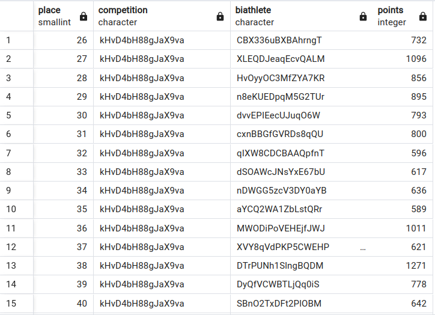
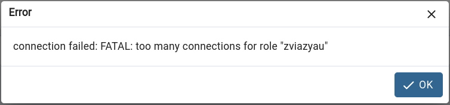

# Advanced database technologies

(Sorry for the code without syntax highlighting in blocks of code. Notion does not export worksheets as PDFs with code highlighting. You can check the [original page](https://zhenyara.notion.site/DBS-b78d2c916e584212a1663821a3f82040?pvs=4) where the code is properly highlighted)

## View

```sql
-- Make view of viewers information
-- (to add to mailing list and send notification to their account for example)
CREATE OR REPLACE VIEW viewers_info AS
    SELECT Site.email, Site.username
    FROM Person
    NATURAL JOIN Viewer
    NATURAL JOIN Site
    WHERE(Viewer.email = Person.email);
```

---

## Index

- **Leaderboard Index**
    
    ```sql
    -- Using this index we can fasete search results of competition by place.
    CREATE INDEX IF NOT EXISTS leaderboard_place
    ON Leaderboard (place);
    ```
    
    - This table is big (~ 38k ) and index helps us make queries faster. We should update index after every competition (after adding all results of competition)
- **Person Index**
    
    ```sql
    -- Index to faster search biathletes/viewers/workers using his/her sex
    CREATE INDEX IF NOT EXISTS person_sex
    ON Person (sex)
    ```
    
    - Person table is not small and its date not changing very often and we can make index of it.

---

# Triggers

- NOTICE:  I added new field to table Biathlete —> Biathlete.points. It has integer type and 0 by default. It increases depending on finish place.

```sql
-- This function updates (increase) points after biathlete finish
-- It depends on finish place.
CREATE OR REPLACE FUNCTION update_points()
RETURNS TRIGGER
AS
$$
DECLARE
    new_points INT := 0;
BEGIN

    IF (NEW.place > 5) AND (NEW.place < 41)  THEN
        new_points := 45 - NEW.place;
    END IF;
    IF (NEW.place < 6) THEN
        new_points := 150  - 20 * NEW.place;
    END IF;

    UPDATE Biathlete
    SET points = points + new_points
    WHERE biathleteID = NEW.biathlete;

    RETURN NEW;
END;
$$
LANGUAGE plpgsql;

-- Triggers when new row added to Leaderboard.
CREATE OR REPLACE TRIGGER update_biathlete_points_after_result
AFTER INSERT
ON Leaderboard
FOR EACH ROW 
EXECUTE FUNCTION update_points();
```

---

## Transactions

```sql
-- Transaction what delete biathlete competition result if he/she cheats (like doping).
-- Also it changes places of another biathletes and their porints
-- If you don't use a transaction here, we will have
-- 1. all places instead of deleted place (break after 1st query)
-- 2. wrong points, wrong places (break after 2nd query)
-- 3. right places, but no points for this places (break after 3rd query)
-- There can be write-read conflict, read-write conflict and write-write conflict.

-- Let's delete result with 28 place on competition with id "kHvD4bH88gJaX9va"

-- Function that returns points for place
CREATE OR REPLACE FUNCTION get_points_for_place(place INT)
RETURNS INT
AS
$$
DECLARE
    new_points INT := 0;
BEGIN

    IF (place > 5) AND (place < 41)  THEN
        new_points := 45 - place;
    END IF;
    IF (place < 6) THEN
        new_points := 150  - 20 * place;
    END IF;

    RETURN new_points;
END;
$$
LANGUAGE plpgsql;

BEGIN; -- Start transaction

SET TRANSACTION ISOLATION LEVEL SERIALIZABLE;

DECLARE
    cur_comp CHAR(32) := 'kHvD4bH88gJaX9va';
    cur_place INT := 28;

-- Deleting 28 place
DELETE FROM Leaderboard WHERE leaderboard.competition = cur_comp AND place = cur_place;

-- Subtract points of current place
UPDATE Biathlete
SET points = OLD.points - get_points_for_place(place)
FROM (
    SELECT biathlete, points, place
    FROM Biathlete
	NATURAL JOIN Leaderboard
) AS subquery
WHERE Biathlete.biathletedID = subquery.biathlete;

-- Update place, decrease place by 1
UPDATE Leaderboard SET place = (OLD.place - 1) 
WHERE leaderboard.competition = cur_comp AND place > cur_place;

-- Increase points of current place
UPDATE Biathlete
SET points = OLD.points + get_points_for_place(place)
FROM (
    SELECT biathlete, points, place
    FROM Biathlete
	NATURAL JOIN Leaderboard
) AS subquery
WHERE Biathlete.biathletedID = subquery.biathlete;

COMMIT; -- If all operation was made

ROLLBACK; -- If an error occurs

-- Using this query we can check our db before and after transaction
SELECT place,competition,biathlete, points
FROM (
	SELECT place,competition,biathlete, points
	FROM Leaderboard 
	NATURAL JOIN Biathlete
	WHERE Biathlete.biathleteID = Leaderboard.biathlete
	) AS subquery
WHERE competition = 'kHvD4bH88gJaX9va' AND place >= 26;
```



There should be image after transaction, but

