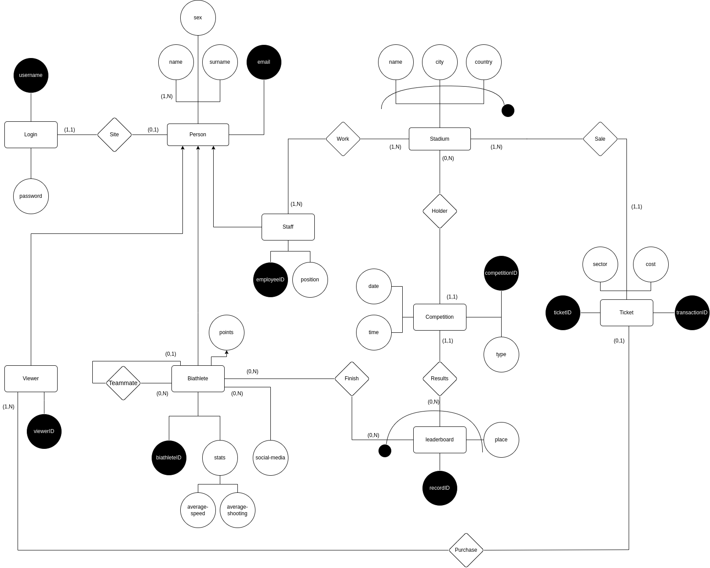

# Conceptual & Relational model

Person(email, surname, sex)

Names(email, name)

FK: (email) ⊆ Person(email)

Login(username,password)

Site(email,username)

FK: (email) ⊆ Person(email)

FK: (username) ⊆ Login(username)

Viewer(email, viewerID)

FK: (email) ⊆ Person(email)

Ticket(ticketID, transactionID, sector, cost)

Purchase(viewerID, ticketID)

FK: (viewerID) ⊆ Viewer(viewerID)

FK: (ticketID) ⊆ Ticket(ticketID)

Staff(email, employeeID, position)

FK: (email) ⊆ Person(email)

Stadium(name, city, country)

Work(employee,stadium-name, stadium-city, stadium-country)

FK: (employee) ⊆ Staff(employeeID)

FK: (stadium-name, stadium-city, stadium-country) ⊆ Stadium(name,city,country)

Sale(ticketID, stadium-name, stadium-city, stadium-country)

FK: (tikcetID) ⊆ Ticket(ticketID)

FK: (stadium-name, stadium-city, stadium-country) ⊆ Stadium(name,city,country)

Biathlete(email, biathleteID, points)

FK: (email) ⊆ Person(email)

Media(biathlete, link)

FK: (biathlete) ⊆ Biathlete(biathleteID)

Stats(biathlete, average-speed, average-shooting)

FK: (biathlete) ⊆ Biathlete(biathleteID)

Teammates(teammate, biathlete)

FK: (teammate) ⊆ Biathlete(biathleteID)

FK: (biathlete) ⊆ Biathlete(biathleteID)

Competition(competitionID, type,date,time)

Holder(competition, stadium-name, stadium-city, stadium-country)

FK: (competition)  ⊆ Competition(competitionID)

FK: (stadium-name, stadium-city, stadium-country) ⊆ Stadium(name,city,country)

Leaderboard(place,competition,biathlete, recordID) 

FK: (competition) ⊆ Competition(competitionID)

FK: (biathlete) ⊆ Biathlete(biathleteID)

Results(competition,recordID)

FK: (competition) ⊆ Competition(competitionID)

FK: (recordID) ⊆ Leaderboard(recordID)

Finish(biathlete, recordID)

FK: (recordID) ⊆ Leaderboard(recordID)

FK: (biathlete) ⊆ Biathlete(biathleteID)